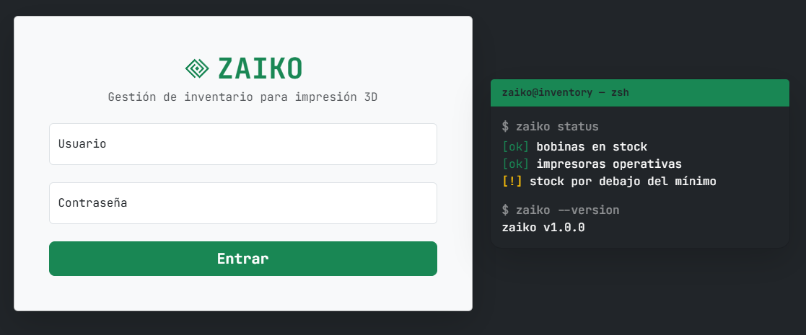
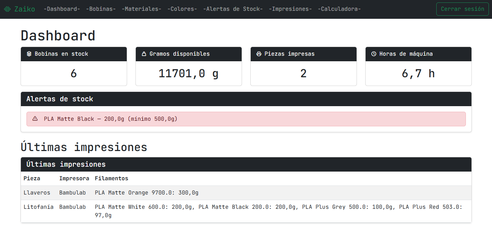
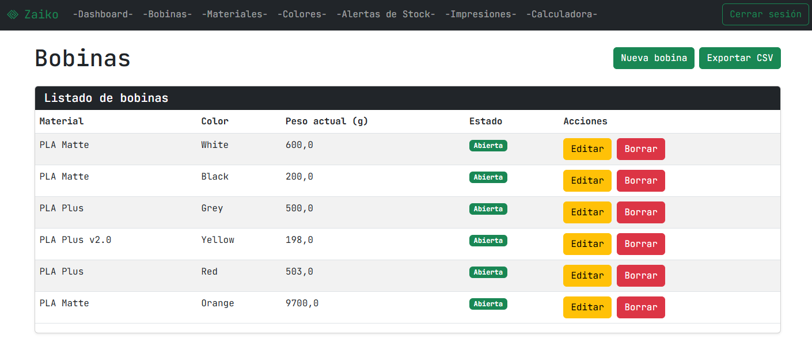
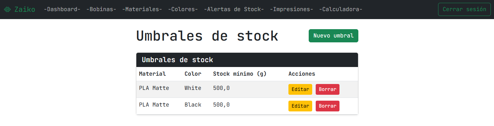
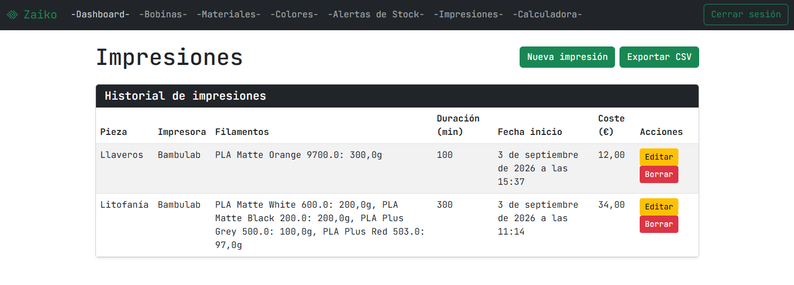
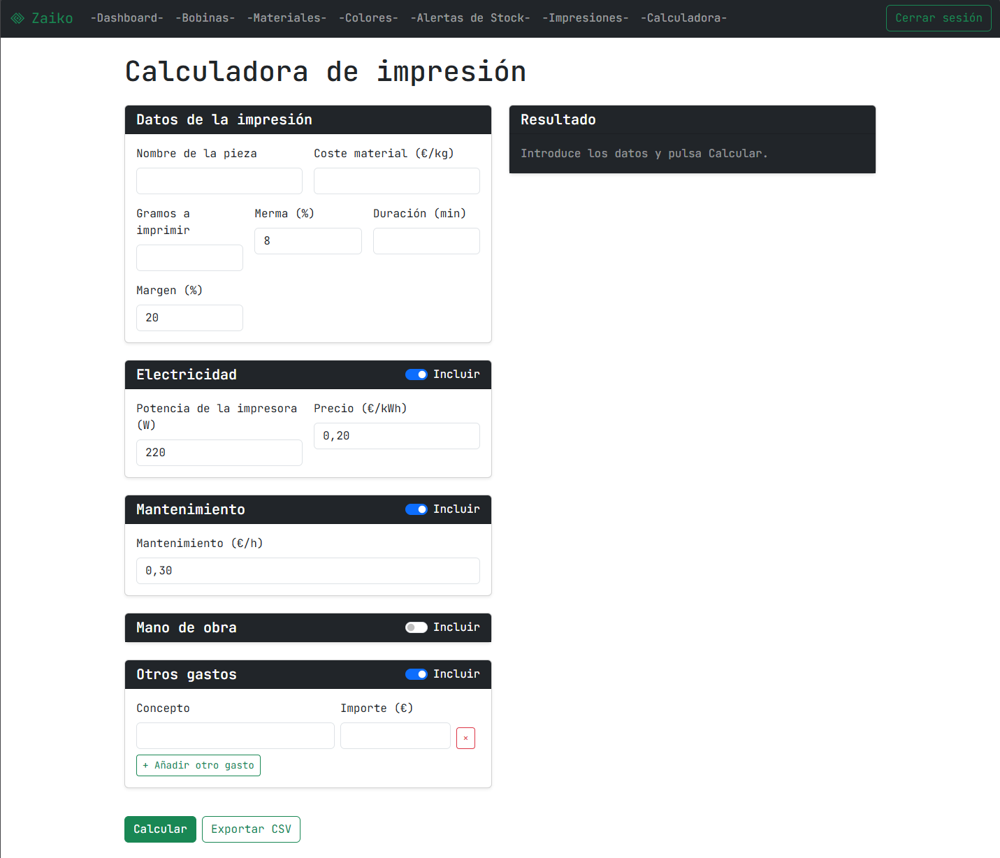

# Zaiko



Sistema de inventario para una empresa pequeña/mediana de impresión 3D: controla bobinas de filamento,
impresoras y órdenes de impresión, con descuento automático de stock, alertas y
calculadora de presupuestos.



## Funcionalidades

- CRUD completo de materiales, colores, umbrales de stock y bobinas.
- Órdenes de impresión multicolor (hasta 6 filamentos) con **descuento automático de stock**.
- Editar y borrar impresiones: revierte el consumo anterior y permite devolver el material.
- Modal de confirmación al guardar con resumen de filamentos.
- Alertas de stock mínimo por combinación material + color.
- Dashboard con KPIs y últimas impresiones.
- Calculadora de presupuestos (merma, electricidad, mantenimiento, mano de obra, otros, margen).
- Roles: admin (todo) y operador.
- Exportación CSV de inventario y de órdenes.

## Stack

| Capa | Tecnología |
|------|------------|
| Backend | Django 6.1 (Python 3.12) |
| Frontend | Templates de Django + Bootstrap 5.3 |
| BD | SQLite (desarrollo) |
| Tests | pytest-django |

## Diagrama de entidades

```
Material ──< Spool >── Color
Material ──< StockThreshold >── Color
Printer  ──< PrintOrder >── Spool
                    └──< PrintOrderItem > (filamentos por orden, máx. 6)
```

## Setup local

Requisitos: 

  - Python 3.12.

```powershell
python -m venv .venv
.venv\Scripts\activate
pip install -r requirements.txt
python manage.py migrate
python manage.py createsuperuser
python manage.py runserver
```

Abre http://127.0.0.1:8000/ en tu navegador.

## Tests

```
pytest
```

## Estructura del proyecto

```
config/     Configuración del proyecto (settings, urls)
inventory/  App principal (modelos, vistas, forms, admin)
accounts/   App de autenticación y roles
```

## Capturas









## Roadmap

- Despliegue en producción con Postgres (Supabase) + Render.

## Licencia

MIT — ver [LICENSE](LICENSE).